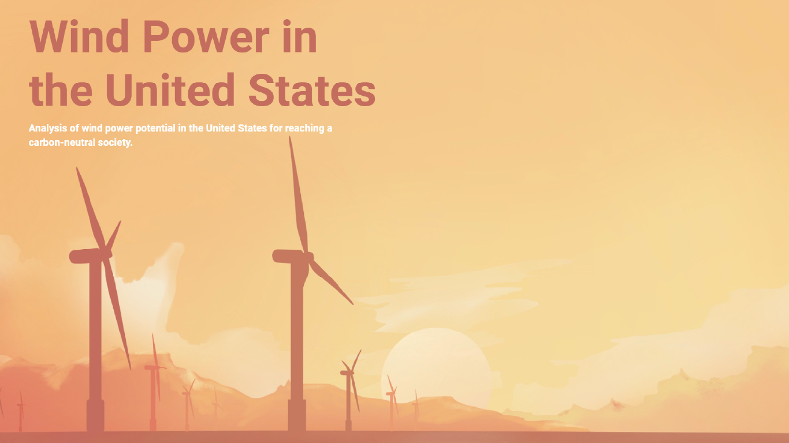
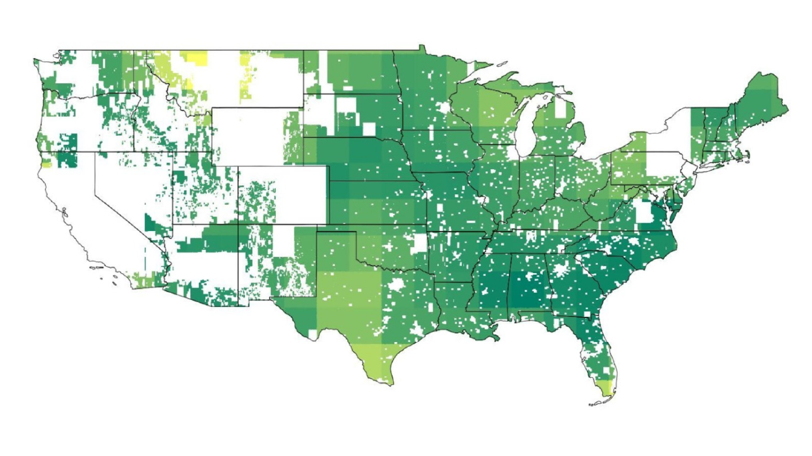
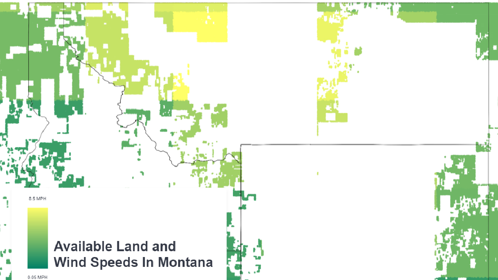
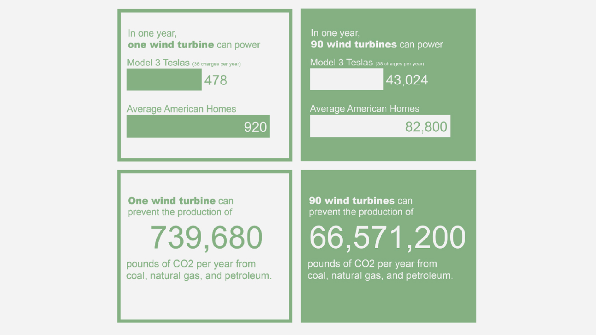

# Wind Power in the United States

## Background
Wind power is one of the oldest and most recognizable types of renewable energy. Many readers may have memories of watching wind turbines through the window on flights or long rides in a car or train. And that is something to be noted; we don’t often see them. They are in areas we ignore. Wind turbines cannot be placed everywhere, and with heights of up to 400 feet, their vibrations adversely affect humans and animals. 

Despite wind power reliability [1], the approximately 54,000 turbines in the United States provided just 7.3% of the country’s energy in 2019 [2]. As shown in Figure 1, turbines are utilized in relatively few areas, especially when considering the United States’ greater than 1.75 million square miles of uninhabited land, as per the last census[3].

Of course, not all of this uninhabited land is ideal for installations. National parks, military bases, geographic entities, and more make wind power untenable in certain areas. Additionally, there needs to be enough wind to rotate the large rotors. 

Research Questions
- Where are the viable locations for the construction of wind turbines?
- How much energy will be generated by the implementation of wind turbines in specific locations?
- How does it affect humans in the future by replacing fossil fuels?

## Dependencies

[USGS United States Wind Turbines Dataset](https://eerscmap.usgs.gov/uswtdb/data/)

[ArcGIS United States Major Cities Dataset](https://hub.arcgis.com/datasets/esri::usa-major-cities?geometry=-107.388%2C31.327%2C-105.081%2C31.737)

[NOAA United States Annual Wind Speed Dataset](https://www.climate.gov/maps-data/dataset/average-wind-speeds-map-viewer)

[USGS United States Protected Areas Dataset](https://www.usgs.gov/core-science-systems/science-analytics-and-synthesis/gap/science/pad-us-data-download?qt-science_center_objects=0#)

[United States Census Cartographic Boundary Dataset](https://www.census.gov/geographies/mapping-files/time-series/geo/carto-boundary-file.html)

## Potential Locations for Turbines
After processing over 100,000 rows of data and sectioning out areas outside of protected areas, established wind turbines within a specified range, we are returned 50,000,000 rows and three columns of data as potential wind turbine locations. When converted into an image, these rows equate to a resolution of 10,000 by 5,000. 

### How did we generate this plot?
Creating a unary union of the 48 states dissolves the state boundaries, giving us a vision of the 48 continental states. Converting this list of boundaries into the exterior removes any potential artifacts from any states failing to connect accurately. And by creating a tupled coordinate list and passing it into Shapely’s Polygon function. Iterating through our coordinates list allows us to create a Point with the Shapely library and check to determine if the latitude and longitude are within the bounding borders. These points are logged into a DataFrame. From this DataFrame, we can visualize the points by plotting a simple state outline and using a scatter plot. This function allowed us to create this plot with only points inside the United States boundaries. We have the ability to set the color based on our wind magnitude, and this gives us the visualization to the right.

## Productivity in Montana
### Highest Average Wind Speeds in the United States
Zooming into Montana, we can see that a large portion of the state consists of the brightest yellow, meaning this location has the highest average wind speeds in the United States at about 8.5 MPH on average. Interestingly, this block of high wind speeds is, for the most part, cut out of the analysis because of currently established wind turbines. Luckily for us, in the Northern end of these high wind values is just over 3.5 million acres of mostly rural land prime for the establishment of wind turbines. We are analyzing the Montana 30-Meter Residential-Scale Wind Resource Map from the Office of Energy Efficiency and Renewable Energy, coming directly out the Rocky mountains' valleys in high gusts of winds pushing through rivers and riverbeds and over the top remaining hills. For the lower elevation points, there are very insignificant amounts of wind. 

## Putting Ideas Into Action
To get a sense of wind turbines' productivity in the Northern section of Montana, we calculated the average size of wind farms in the United States, equating to 90 turbines per farm. With wind speeds typically between 8 to 12.5 Miles Per Hour, we can expect turbines to produce on average 1.69 Megawatts (mW) per day. With modern wind technology, it is reasonable to see 2 mW through 2.5 mW generated per day or 912,500 Kilowatts (kW) per year for a single turbine in these conditions. It is appropriate for a farm of highly advanced and well-placed turbines to expect 82,125,000 kW per year. 

This amount of energy is not an insignificant amount of power; it can power many of our daily lives and reduce carbon emissions locally and globally. Below in Figure 7 is the Northernmost highly windy area in Montana, plotted with 90 wind turbines. Let's look at what this energy amount gets us and what it can do for our environment.

## Conclusion

### Summary
Wind is a reliable but underutilized renewable energy source with great potential in the United States. This project took the first steps towards realizing this potential by identifying the country’s most optimal areas for new turbines. We found these areas through a systematic geographic analysis of the country, which excluded areas with existing turbines, cities, and designated protected areas. The remaining regions are visualized with a gradient color indicating mean annual wind speeds. We can see the most optimal locations for turbine construction by the brighter yellow color; the most notable states are Montana, central and south Texas, and southern Florida. 

The data used in this analysis come from reputable sources in the science and geographic communities, such as ESRI, U.S. National Oceanic and Atmospheric Administration (NOAA), and the United States Geological Survey (USGS). The datasets were combined across their geographic features using a method James coined aforementioned “master array.”

### Additional Insights
Beyond the optimal areas our analysis identifies, we discovered that much of the United States’ wind power potential lies offshore. While our study only considered land turbines, these offshore locations will undoubtedly play an essential role in wind power growth.

Slightly removed from the analysis, we also discovered that GIS is superior to programming-based approaches for spatial data science projects like this one. Although we created some useful techniques to accomplish this analysis, geographic information systems could produce a more comprehensive investigation of this subject.

### What Worked and What Didn’t Work
The project took several ideological iterations to run smoothly. The original intent to predominantly use geospatial Python libraries proved untenable due to the size of our datasets and suboptimal library conventions. The project also had graphical struggles, as our large datasets and relatively average computing resources struggled to render the detailed visualizations. Beyond these issues, the project ran smoothly. We developed the “master array,” which turned out to be a more optimal workaround for the geospatial library troubles. Although the master array did not alleviate our infrastructure issues for rendering visualizations, it gave us much greater control in determining the resolution of our analysis and results. Additionally, we were fortunate to work with well-maintained datasets that required little to no cleaning and manipulation.

### Next Steps
Identifying the areas feasible for wind turbine construction is the first of many steps needed for mass adoption of wind power. There are lingering questions about infrastructure and engineering and many discussions about turbine machinery and energy transmission and storage. There are financial questions of cost and who should put up the money for such ventures. There are environmental concerns-will turbines upset our wildlife? There are political questions-who gets turbines first? There are social questions-do we want wind turbines near our towns or in our counties? Most notably, there are layered, integrated questions, which concern several of these subject areas on top of additional geographical context.

There is much left to do before our society can comfortably scale wind power to its potential. This project has taken the first step in this journey towards a wind-powered sustainable future, and the authors hope for continued progress to that end.

